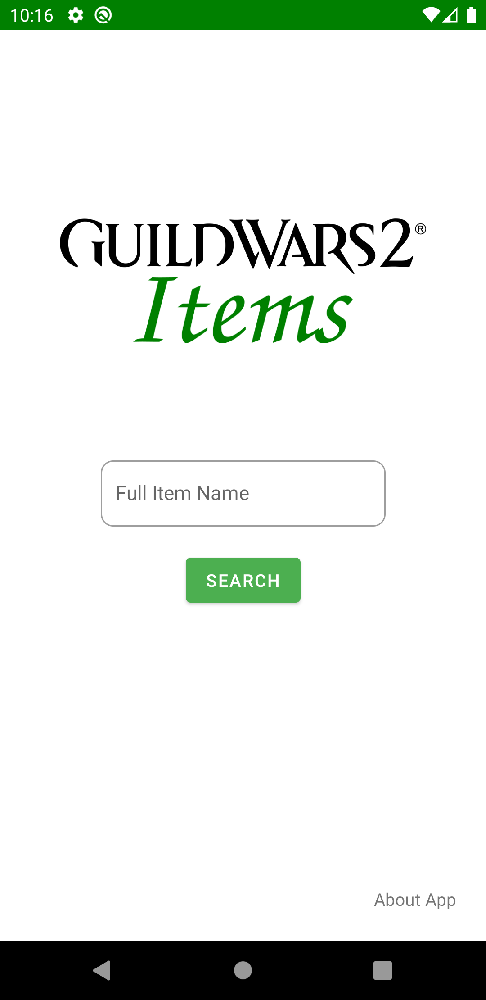
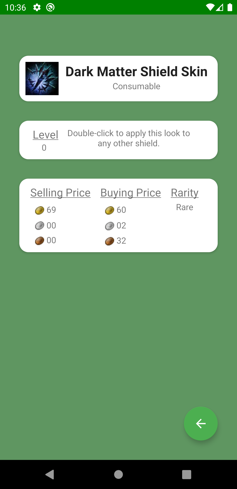
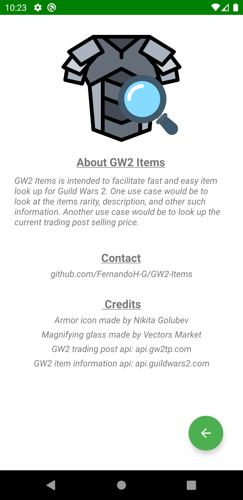

# GW2-Items

## Description
This application will allow the user to make queries on the current selling/buying price of an item in GW2.  
The queries are case insensitive.

## Tech Goals
+ MVVM - Followed ModelView View Model pattern to ease coupling concerns. Separated components into presentation, view model, and repository layers.
+ Live Data - Used android observables to make the presentation layer.
+ GraphQL + Apollo Android - Utilize companion GQL + GO [API server](https://github.com/FernandoH-G/GW2-Items-Server) to handle network requests and make the repository layer. [Apollo Android](https://www.apollographql.com/docs/android/) was used to generate classes to facilitate GQL queries to the API server. Previously used Retrofit.
+ Navigation Components - Use fragment navigation to easily move between views.
+ Material Design Components - Utilize Android Material design themeing tools to create a pleasing UI.

## Academic Goals
+ Utilize my own custom API server to more efficiently handle network requests. Single source of truth for my data.
+ Use most up to date Android Development Tools available to create a modern Android application.

# Future plans
* Improve visual appeal.
* Add more historical data on the queried item.
* Add profiles.
* Open to suggestions!

# Screenshots

## Home  
  
   

## Search Result  
  

## About
  
   

